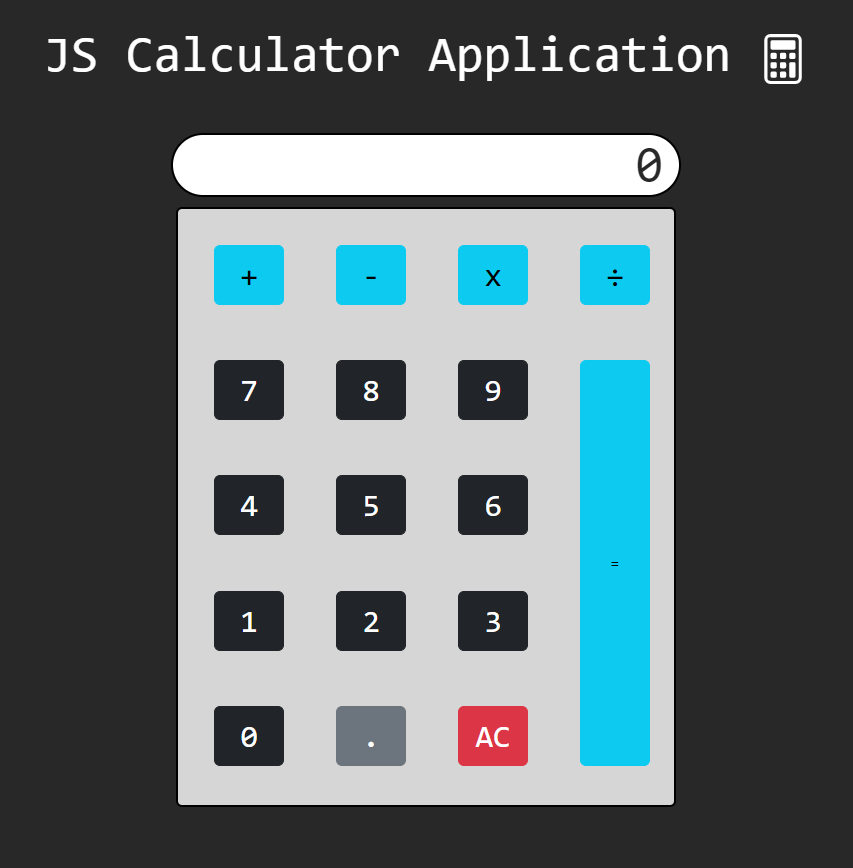

**_
JS Projects Series | 3 - Calculator
_**

**The purpose of this project series is to present JS projects for the beginner level. Correspondingly, fundamental knowledge of HTML and CSS is required.**

In this application, basically, a simple calculator that can perform 4 mathematical operations has been made. When each operator is pressed, it calculates the relevant operation dynamically and reflects it on the result screen. The design of the application is given in the figure.

  
   

The content of the Calculator application;

- Fundemantel JS
- JS setInterval
- JS Events
- JS Try | Catch
- Basic HTML
- Basic CSS
- Basic Bootstrap
