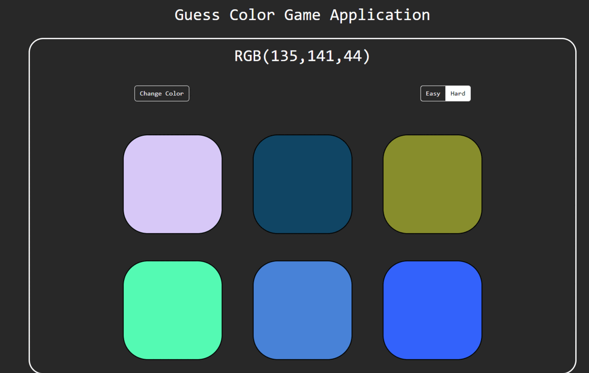

***
JS Projects Series | 5 - Guess Color Game 
***

**The purpose of this project series is to present JS projects for the beginner level. Correspondingly, fundamental knowledge of HTML and CSS is required.**

In this application, a random color is produced and the color produced is asked to the player. The game has an animation for wrong and correct answers. Easy and Hard options change the number of options. The output of my application is given in the gif.

 

  
   

 

The content of the Guess Color Game application;

- Fundemantel JS
- JS Events
- JS setTimeout
- JS Math
- Basic HTML
- Basic CSS
- Basic Bootstrap

