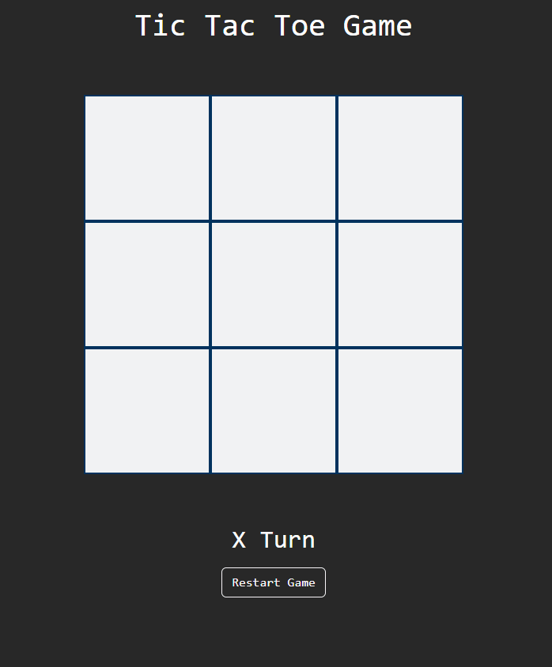

***
JS Projects Series | 7 - Tic Tac Toe 
***

**The purpose of this project series is to present JS projects for the beginner level. Correspondingly, fundamental knowledge of HTML and CSS is required.**

A classic Tic Tac Toe game has been made in this app. The order of the players changes automatically after the move, and the game can be started over with the game button.

 

  
   

 

The content of the Tic Tac Toe application;

- Fundemantel JS
- JS Events
- Basic HTML
- Basic CSS
- Basic Bootstrap

