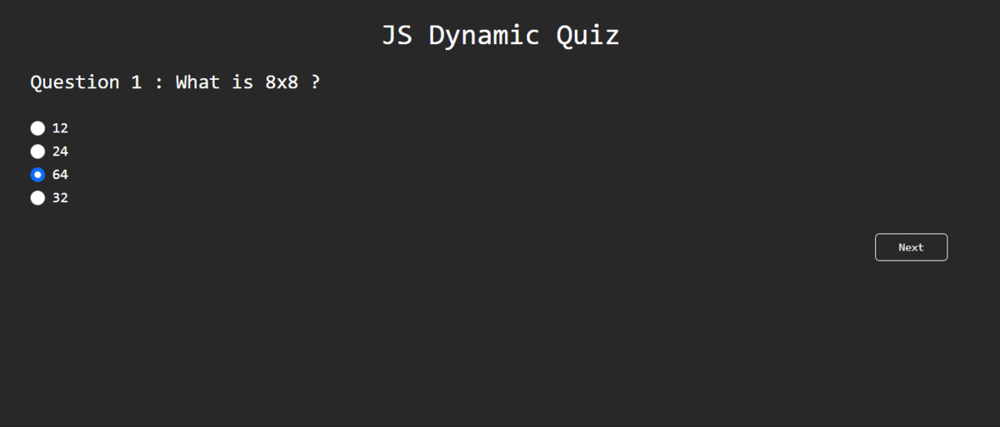

***
JS Projects Series | 9 - Dynamic Quiz 
***

**The purpose of this project series is to present JS projects for the beginner level. Correspondingly, fundamental knowledge of HTML and CSS is required.**

A dynamic quiz which is consist of 5 questions, has been prepared for this application.You can scroll through the questions and start the quiz all over again.

 

  
   

 

The content of the Dynamic Quiz application;

- Fundemantel JS
- JS Events
- Functions
- DOM
- Basic HTML
- Basic CSS
- Basic Bootstrap

