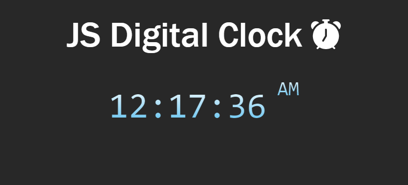

***
JS Projects Series | 1 - Digital Clock
***

**The purpose of this project series is to present JS projects for the beginner level. Correspondingly, fundamental knowledge of HTML and CSS is required.**

Basically, within the scope of the application, a digital clock was made in 12-time zone format. The output of the application is presented in the images.

  
   

The content of the Digital Clock application;

- Fundemantel JS
- JS Date Object
- JS setInterval
- JS Events
- Basic HTML
- Basic CSS
- Basic Bootstrap

