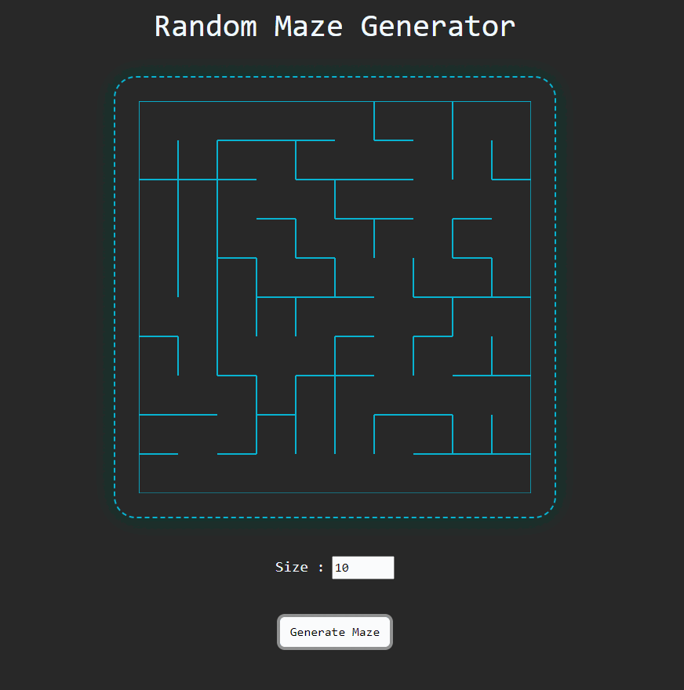

***
JS Projects Series | 10 - Random Maze Generator 
***

**The purpose of this project series is to present JS projects for the beginner level. Correspondingly, fundamental knowledge of HTML and CSS is required.**

It is a frontend project that creates a random maze based on the entered "Size" parameter.

 

  
   

 

The content of the Random Maze Generator application;

- Fundemantel JS
- JS Events
- Object
- Class
- Functions
- Algorithm
- DOM
- Basic HTML
- Basic CSS
- Basic Bootstrap

