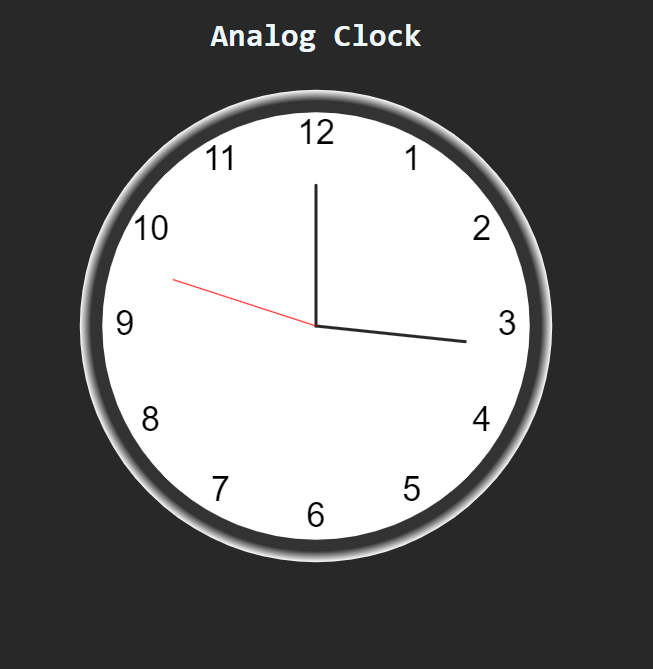

***
JS Projects Series | 11 - Analog Clock
***

**The purpose of this project series is to present JS projects for the beginner level. Correspondingly, fundamental knowledge of HTML and CSS is required.**

A standard analog clock has been made in this application. The clock updates itself each second.

Inspired by analog clock app on "https://www.w3schools.com"

 

  
   

 

The content of the Analog CLock application;

- Fundemantel JS
- JS Events
- Functions
- DOM
- Canvas
- Basic HTML
- Basic CSS
- Basic Bootstrap

