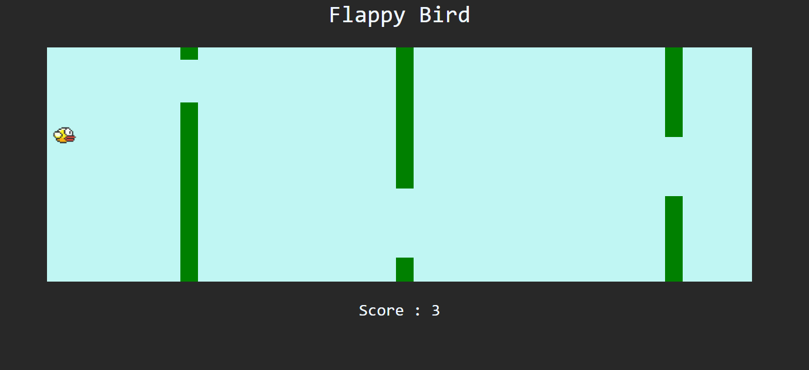

***
JS Projects Series | 12 - Flappy Bird
***

**The purpose of this project series is to present JS projects for the beginner level. Correspondingly, fundamental knowledge of HTML and CSS is required.**

Flappy Bird is a simple version of the game made using js/html/css. 

 

  
   

 

The content of the Flappy Birdapplication;

- Fundemantel JS
- JS Events
- Functions
- DOM
- Events
- Basic HTML
- Basic CSS
- Basic Bootstrap

