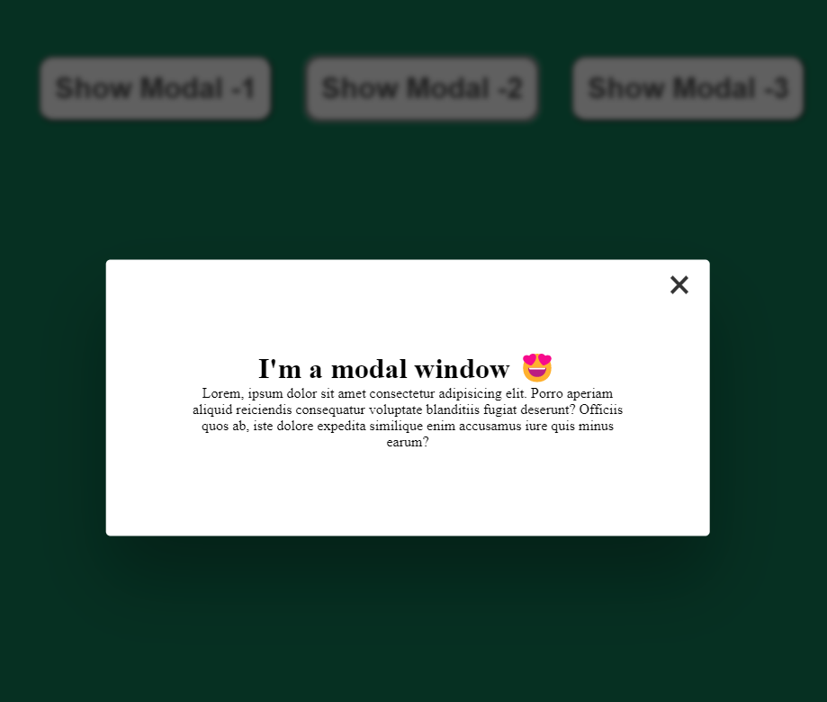

**_
JS Projects Series | 13 - Show Modal Window 
_**

**The purpose of this project series is to present JS projects for the beginner level. Correspondingly, fundamental knowledge of HTML and CSS is required.**

This application covers the display of a simple model window. The purpose of this is to use different document events.

 

  
   

 

The content of the Show Modal Window application;

- Fundemantel JS
- JS Events
- Basic HTML
- Basic CSS
