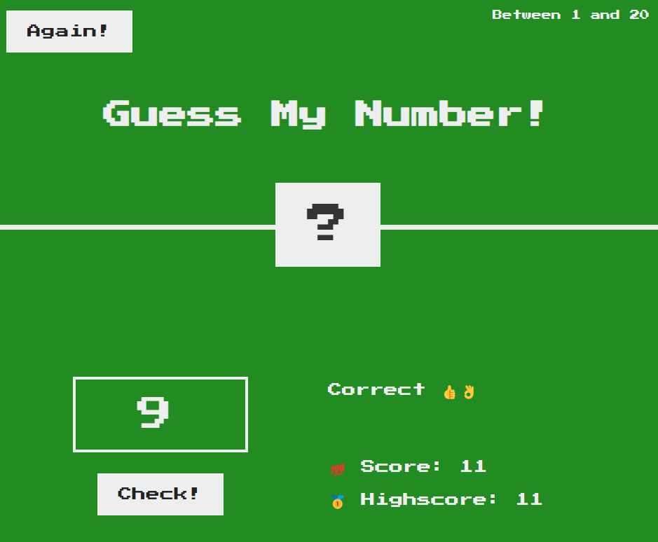

**_
JS Projects Series | 14 - Guess My Number 
_**

**The purpose of this project series is to present JS projects for the beginner level. Correspondingly, fundamental knowledge of HTML and CSS is required.**

In this application, a random number between 0 and 20 is generated and the generated number is asked to the player.

 

  
   

 

The content of the Guess My Number Game application;

- Fundemantel JS
- JS Events
- JS Math
- Basic HTML
- Basic CSS
