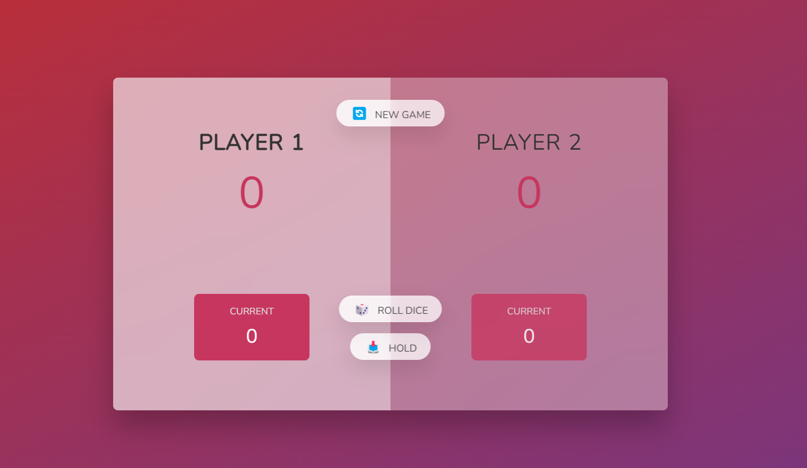

**_
JS Projects Series | 15 - Pig Game 
_**

**The purpose of this project series is to present JS projects for the beginner level. Correspondingly, fundamental knowledge of HTML and CSS is required.**

This application implements the classic Pig Game. Players roll the dice and collect points until they are ready to take the turn, but if the dice come up 1, their score is reset.

HTML and CSS files are taken from [here](https://github.com/jonasschmedtmann/complete-javascript-course/tree/master/07-Pig-Game/final).

 

  
   

 

The content of the Pig Game application;

- Fundemantel JS
- JS Events
- JS Math
- Basic HTML
- Basic CSS
