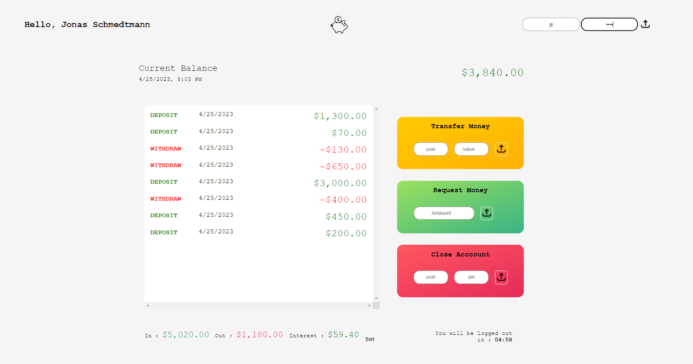

**_
JS Projects Series | 16 - Bank App
_**

**The purpose of this project series is to present JS projects for the beginner level. Correspondingly, fundamental knowledge of HTML and CSS is required.**

 

This app is a remake of the Jonas Schmedtmann Bankist app.

 

  
   

 

The content of the Bank App application;

- Fundemantel JS
- JS Events
- JS Arrays
- JS Funtions
- Basic HTML
- Basic CSS
