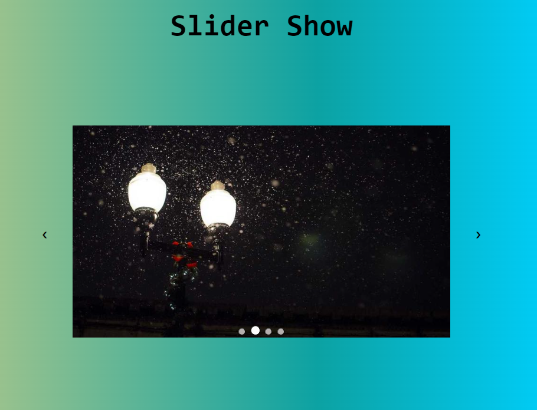

**_
JS Projects Series | 17 - Slider Show
_**

**The purpose of this project series is to present JS projects for the beginner level. Correspondingly, fundamental knowledge of HTML and CSS is required.**

 

In this application, a basic slide transition is applied. Slide transitions are made from both the right - left buttons and the buttons under the slide.

 

  
   

 

The content of the Slider Show application;

- Fundemantel JS
- JS Events
- Function Bind
- JS Funtions
- Basic HTML
- Basic CSS
