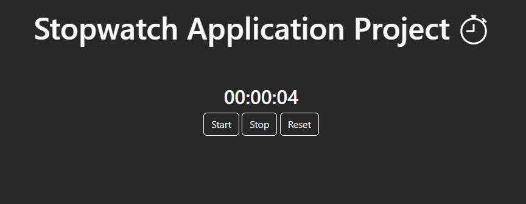

***
JS Projects Series | 2 - STOPWATCH
***

**The purpose of this project series is to present JS projects for the beginner level. Correspondingly, fundamental knowledge of HTML and CSS is required.**

Basically, there are Start, Stop and Reset functions. When the time is stopped, the Start button turns into a Resume button.The output of the application is presented in the images.

  
   
  

The content of the Stopwatch application;

- Fundemantel JS
- JS Events
- JS Date Object
- JS setInterval
- Basic HTML
- Basic CSS
- Basic Bootstrap

