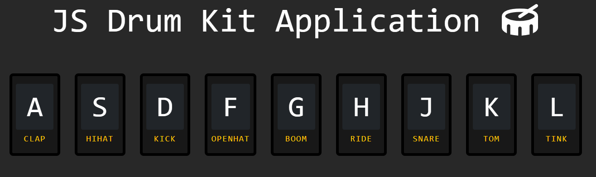
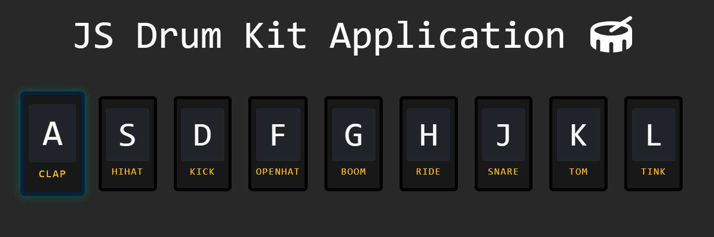

***
JS Projects Series | 4 - Drum Kit 
***

**The purpose of this project series is to present JS projects for the beginner level. Correspondingly, fundamental knowledge of HTML and CSS is required.**

A standard drum kit demo is made in this application. When a key on the keyboard is pressed, the corresponding instrument sound is played.

 

  
   
  

 

The content of the Drum Kit application;

- Fundemantel JS
- JS Events
- JS setTimeout
- Basic HTML
- Basic CSS
- Basic Bootstrap

