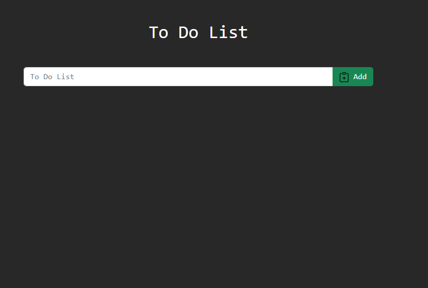

**_
JS Projects Series | 6 - To Do List 
_**

**The purpose of this project series is to present JS projects for the beginner level. Correspondingly, fundamental knowledge of HTML and CSS is required.**

In this application, a To Do List application has been made. There is a warning system and a check mechanism for adding to the list.

 

  
   

 

The content of To Do List application;

- Fundemantel JS
- JS Events
- JS setTimeout
- Basic HTML
- Basic CSS
- Basic Bootstrap
