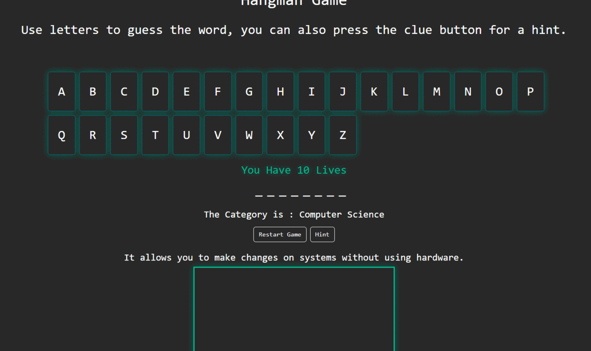

**_
JS Projects Series | 8 - Hangman 
_**

**The purpose of this project series is to present JS projects for the beginner level. Correspondingly, fundamental knowledge of HTML and CSS is required.**

A classic game of hangman is presented. As wrong answers are given, a step-by-step drawing is made. It randomly asks different words from different categories. You can also get hints for each question.

 

  
   

 

The content of the Hangman application;

- Fundemantel JS
- JS Events
- Functions
- DOM
- Basic HTML
- Basic CSS
- Basic Bootstrap
